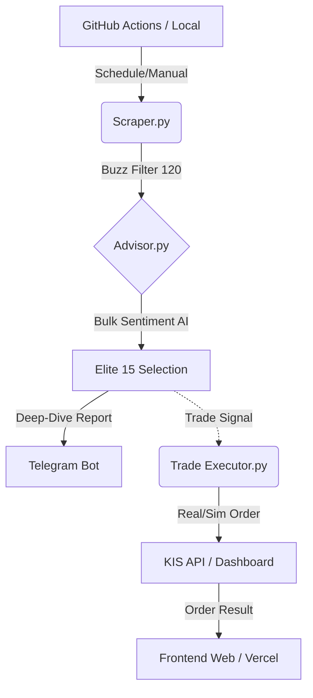

# ARCHITECTURE_V8.4: Attention Deep-Dive & Real-Trade

이 문서는 2026년 4월 6일 기준, 주식 봇 서비스의 전체 구조와 핵심 로직을 설명합니다.

## 1. 전체 파이프라인 흐름 (System Workflow)

전체 시스템은 데이터 수집부터 실행까지 유기적으로 연결된 5단계 구조로 작동합니다.

1.  **Trigger**: GitHub Actions가 15:00(KST) 등 정해진 시간에 `scraper.py`를 호출합니다.
2.  **Analysis**: `scraper.py`와 `advisor.py`가 협력하여 시장 데이터를 분석하고 종목을 선정합니다.
3.  **Notification**: 분석된 인사이트 리포트를 텔레그램으로 즉시 발송합니다.
4.  **Backend**: Vercel에 배포된 Next.js 백엔드가 KIS API와의 실거래 통신을 담당합니다.
5.  **Execution**: `trade_executor.py`가 예약된 주문이나 실거래 명령을 최종 집행합니다.

## 2. 3단계 '깔때기(Funnel)' 분석 구조

Gemini API 비용을 99% 절감하면서도 분석의 정밀도를 높인 핵심 로직입니다.

-   **1단계 (Buzz Filter)**: 
    - 15:00 KST 기준 토론방 게시글 증가량이 **120개** 이상인 종목만 필터링합니다. 
    - 타 시간대에는 현재 시간에 맞게 임계값이 동적으로 자동 조정됩니다.
-   **2단계 (Bulk Body Sentiment)**: 
    - 1단계를 통과한 모든 종목(약 20~40개)의 베스트 게시글 본문을 싹 긁어 모읍니다.
    - 이를 Gemini `gemini-2.5-flash` 모델에 **단 1회** 전달하여 한꺼번에 감성 점수(-10~10)를 산출합니다. (개별 호출 차단)
-   **3단계 (Final Selection & Deep-Dive)**: 
    - [기술 지표(ML Prob) + AI 감성 점수]를 합산하여 상위 15개를 "정예군"으로 선정합니다.
    - 최상위 5개 종목에 대해서는 별도의 뉴스/공시 대조 리포트를 작성하여 텔레그램으로 발송합니다.

## 3. 주문 및 실행 구조 (Order Management)

-   **실거래 우선주의**: 대시보드 및 서비스에서 발생하는 `REAL` 타입 주문은 모든 시뮬레이션 제한을 무시하고 즉시 KIS API로 전송됩니다.
-   **예약 주문 캐치업(Catch-up)**: `trade_executor.py` 실행 시 `status.json` 내의 예약 목록을 전수 조사하여, 목표 시간이 지났음에도 아직 `PENDING` 상태인 주문을 즉시 집행합니다.
-   **안전 장치**: KIS API 호출 시 발생할 수 있는 `SYDB0050` 에러 방지를 위해 페이징 파라미터(`tr_cont`)를 명시적으로 초기화합니다.

---
*Last Updated: 2026-04-06 19:50 (V8.4 Milestone)*
